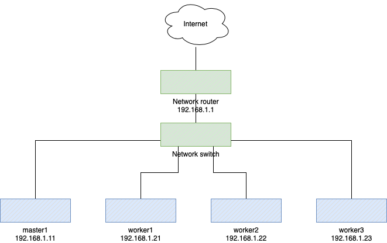

## はじめに

この手順を辿れば、Kubernetes Clusterが完成します。

Kubernetes Clusterを手元で作れば、クラウドのマネージドサービスに費用を払い続けることなく、動作を理解することができるんじゃないかな〜ってことでRaspberry Pi 4BでK3s Cluster環境を作ってみました。
マネージドサービスだとMaster Nodeがみえない(っていうか理解しにくい)ので、物理的に目に見える方が楽かも？

*Kubernetes自体、Pod、Deployment、StatefulSet、Namespace、CNIなど、基本を理解したい場合は、他の記事を読むことをお勧めします。最終的には理解してないとClusterとしての動作がわからんのですが、、、*

## この記事について
仕事の都合上、Kubernetesと戯れることが良くあります。周りからも聞かれることがあります。
でも、初めのうちは、本でも読んで、自分で頑張ってみて〜って言っていました。
が、ちゃんと業務で使えるレベルに情報共有しておいた方が良いかもね、と思い立ったので記事書きます。
ここでは、Kubernetes Clusterを作って、その仕組みを理解しよう、という目的とします。マネージドサービスを使う前に仕組みを理解しておこうって感じの取り組みでも良いと思います。  

学習コストを極力下げるという意図もあり、K3sを使いました。
オリジナルのKubernetesをインストールするとか、CNIは何にしよう、とか面倒なことは省きます。
自分が学ぶときは、オリジナルのKubernetesを手順を一つ一つ追って、セットアップしました。それで理解したのですが、ほんの数年で超簡単になりましたね〜

## 1.前提条件

- インターネットアクセス環境
- LinuxをCLIのみで触る程度の知識か根性

## 2.環境を用意
### ハードウェア
- Raspberry Pi 4B 4GB Memory 4台 (3B/3B+でもインストール可能ですが、期待する動作をしませんでした)
- キーボード、マウス、ディスプレイは1セットあればOK
- 有線LANか無線LAN
- MACかWindows (OSイメージ作成用とSSHアクセス用のホスト)

### ソフトウェア
- OS: [Ubuntu Server 20.04.2 LTS 64ビット](https://ubuntu.com/download/raspberry-pi)
- OSイメージ作成ツール: [balenaEthcher](https://www.balena.io/etcher)
- K3s: [v1.20.6+k3s1](https://k3s.io)  
*ネイティブKubernetesをインストールしても良いですが、CNI何にしよう、とか色々考える必要のないK3sが手元で試すKubernetes Clusterとしてはベストだと思います。たぶん。*

### 構成イメージ
クラスタ構成なので、workerを3台用意しています。master 1台とworker 1台でも機能検証はできるかと思います。



## 3.下準備
### OSイメージ作成
- SDカードを用意し
- OSイメージ作成用のMACかWindowsでbalenaEtcherをダウンロードして実行
- 左からOSイメージの指定、ドライブ(SDカード)の指定、実行ボタン


### 起動とOSセットアップ
- Raspberry PiにSDカードを挿入し、起動  
*事前にnetwork設定を指定する方法もありますが、今回はOS起動後に指定しています*

- 初期ログイン

```shell:初期ログイン
Username: ubuntu
Password: ubuntu #ログイン後変更を促される
```

- ネットワーク設定ファイルの修正

```shell:cloud-init.yaml
sudo cp /etc/netplan/50-cloud-init.yaml /etc/netplan/99-cloud-init.yaml # ファイルをコピー
sudo vi /etc/netplan/99-cloud-init.yaml
```
- 99-cloud-init.yamlの修正

```shell:修正例
# to it will not persist across an instance reboot.  To disable cloud-init's
# network configuration capabilities, write a file
# /etc/cloud/cloud.cfg.d/99-disable-network-config.cfg with the following:
# network: {config: disabled}
network:
    version: 2
    ethernets: # 有線LANの設定
        eth0:
            dhcp4: false           #固定IPを付与
            addresses:             #
            - 192.168.1.11/24       #付与したいIPアドレス
            gateway4: 192.168.1.1  #IPv4のデフォルトゲートウェイ
            nameservers:           #DNSサーバ指定
                addresses:         #
                - 192.168.1.1      #DNSサーバのIPアドレス
    wifis: # 無線LANの設定
        wlan0:
            dhcp4: true # 固定IPの場合、falseにする
            optional: true
            access-points:
              <yourssid>: # SSIDを<youssid>の箇所に入力、コロンの後に改行
                password: “<yourpassword>” # パスワードはダブルクオートで囲む

```

- netplan applyの実行

```shell:ネットワーク設定変更の適用
sudo netplan apply # 設定変更の適用
```

- キーボード設定

```shell:キーボード設定
sudo dpkg-reconfigure keyboard-configuration
```

- その他設定の確認

```shell:その他設定の確認
sudo ufw status
Status: inactive # activeになっている場合はk3sの通信要件などを整理し、適切に設定すること
```
## 4.K3sインストール
ここからが本番ですが、準備あらかた終わったとも言える
### K3s動作条件の設定
- コントロールグループ設定追加  
`/boot/firmware/cmdline.txt`に`"cgroup_memory=1 cgroup_enable=memory"`を改行せず1行で記載すること  
設定変更後に再起動

```shell:コントロールグループ設定追加
sudo vi /boot/firmware/cmdline.txt # エラー結果では、/boot/cmdline.txtとなっているが、本環境では下記の通り
net.ifnames=0 dwc_otg.lpm_enable=0 console=serial0,115200 console=tty1 root=LABEL=writable rootfstype=ext4 elevator=deadline rootwait fixrtc cgroup_memory=1 cgroup_enable=memory
```

*上記設定を行わずにK3sをインストールすると、K3s Serverが起動しません。手動起動するとエラーが出力されます。しかーし、`/boot/cmdline.txt`というファイルがありません。正解はUbuntu 20.04.2 LTSではパスが`/boot/firemware/cmdline.txt`です。*
*インストールスクリプトをこの設定の前に実行するとエラー表示されません。下記は明示的に実行した場合に表示されるエラーです。*

```shell:k3s実行時のエラー
sudo k3s server &
# 中略
INFO[2021-05-01T09:31:09.012475490Z] Run: k3s kubectl                             
ERRO[2021-05-01T09:31:09.012840509Z] Failed to find memory cgroup, you may need to add "cgroup_memory=1 cgroup_enable=memory" to your linux cmdline (/boot/cmdline.txt on a Raspberry Pi)
FATA[2021-05-01T09:31:09.012916768Z] failed to find memory cgroup, you may need to add "cgroup_memory=1 cgroup_enable=memory" to your linux cmdline (/boot/cmdline.txt on a Raspberry Pi)

```

### K3s Master Nodeインストール
[K3sのページ](https://k3s.io)では、手順は超シンプル、とガイドされています。インストールコマンド叩いて、ちょっとまって(30秒?)、k3s kubectl get nodeでノードがReadyになったことを確認する、と。これは本当です。ネイティブのK8sと比較すると、すごい、以外の言葉はありません。
が、ここでは、やりたいことがあるので、オプション付きで進めます。

```shell:インストールコマンド
curl -sfL https://get.k3s.io | sh -s - --write-kubeconfig-mode 644
[INFO]  Finding release for channel stable
[INFO]  Using v1.20.6+k3s1 as release
[INFO]  Downloading hash https://github.com/k3s-io/k3s/releases/download/v1.20.6+k3s1/sha256sum-arm64.txt
[INFO]  Downloading binary https://github.com/k3s-io/k3s/releases/download/v1.20.6+k3s1/k3s-arm64
[INFO]  Verifying binary download
[INFO]  Installing k3s to /usr/local/bin/k3s
[INFO]  Creating /usr/local/bin/kubectl symlink to k3s
[INFO]  Creating /usr/local/bin/crictl symlink to k3s
[INFO]  Creating /usr/local/bin/ctr symlink to k3s
[INFO]  Creating killall script /usr/local/bin/k3s-killall.sh
[INFO]  Creating uninstall script /usr/local/bin/k3s-uninstall.sh
[INFO]  env: Creating environment file /etc/systemd/system/k3s.service.env
[INFO]  systemd: Creating service file /etc/systemd/system/k3s.service
[INFO]  systemd: Enabling k3s unit
Created symlink /etc/systemd/system/multi-user.target.wants/k3s.service → /etc/systemd/system/k3s.service.
[INFO]  systemd: Starting k3s
```

K3sサービスの状態確認
下記のようになれば、正常に起動しています。

```shell:K3sサービスの状態確認
systemctl status k3s.service
● k3s.service - Lightweight Kubernetes
     Loaded: loaded (/etc/systemd/system/k3s.service; enabled; vendor preset: enabled)
     Active: active (running) since Sun 2021-06-06 07:29:58 UTC; 4min 15s ago
       Docs: https://k3s.io
    Process: 57278 ExecStartPre=/sbin/modprobe br_netfilter (code=exited, status=0/SUCCESS)
    Process: 57279 ExecStartPre=/sbin/modprobe overlay (code=exited, status=0/SUCCESS)
   Main PID: 57280 (k3s-server)
      Tasks: 79
     Memory: 838.1M
     CGroup: /system.slice/k3s.service
             ├─57280 /usr/local/bin/k3s server
             ├─57327 containerd
             ├─57752 /var/lib/rancher/k3s/data/0dcf6a30692cdc1e18883dd61731c3409485860ca27bfade8ecaf05cf64b72d0/bin/con>
             ├─57783 /var/lib/rancher/k3s/data/0dcf6a30692cdc1e18883dd61731c3409485860ca27bfade8ecaf05cf64b72d0/bin/con>
             ├─57792 /pause
             ├─57819 /var/lib/rancher/k3s/data/0dcf6a30692cdc1e18883dd61731c3409485860ca27bfade8ecaf05cf64b72d0/bin/con>
             ├─57851 /pause
             ├─57858 /pause
             ├─57945 local-path-provisioner start --config /etc/config/config.json
             ├─58012 /metrics-server
             └─58019 /coredns -conf /etc/coredns/Corefile

```

Master Node (K3sでは、Server Nodeと呼称するようですが、ここではMasterと記載します)の状態とPodがデプロイされたことを確認します。

```shell:nodeの確認
sudo kubectl get nodes
NAME     STATUS   ROLES                  AGE   VERSION
ubuntu   Ready    control-plane,master   18h   v1.20.6+k3s1
```

```shell:podの状態確認
sudo kubectl get pods -A
NAMESPACE     NAME                                      READY   STATUS      RESTARTS   AGE
kube-system   metrics-server-86cbb8457f-vgw9n           1/1     Running     0          18h
kube-system   local-path-provisioner-5ff76fc89d-tjmgp   1/1     Running     0          18h
kube-system   coredns-854c77959c-vqscp                  1/1     Running     0          18h
kube-system   helm-install-traefik-gp4kc                0/1     Completed   0          18h
kube-system   svclb-traefik-wh5s6                       2/2     Running     0          18h
kube-system   traefik-6f9cbd9bd4-zt8pd                  1/1     Running     0          18h
```
ここまでで、Server Node (Master Node) 1台目のセットアップはできました。1台で使う場合は以上で終了です。

## 5.K3s のCluster構成化
ここからはクラスタ構成にするためのセットアップです。
*この手順は、Master Nodeを冗長構成にするための手順となります。Masterをシングル構成にする場合、スキップ可能な手順です*

### MasterとWorkerによるCluster構成の設定
各Nodeのhostnameをユニークな名称で

```shell:/etc/hostname
sudo vi /etc/hostname
master1
```
各nodeでhostsファイルを編集し、hostnameでの通信ができるよう設定

```shell:/etc/hosts
sudo vi /etc/hosts
192.68.1.11 master1
192.168.1.21 agent1
192.168.1.22 agent2
192.168.1.23 agent3
```

K3s Master Nodeのnode-tokenを確認

```shell:node-tokenの確認
sudo cat /var/lib/rancher/k3s/server/node-token
K10***0f #省略しています
```
K3s agent nodeのInstall (Agentの3台分実施)
*Raspberry Piで必要なおまじない、コントロールグループの設定は、全てのnodeで行うこと*
*ノード間でホスト名が名前解決できる必要がある*

```shell:Agentのインストール
curl -sfL https://get.k3s.io | K3S_URL=https://master1:6443 K3S_TOKEN=K10****0f sh -f
```
Nodeを確認

```
kubectl get nodes -o wide
NAME      STATUS   ROLES                  AGE     VERSION        INTERNAL-IP    EXTERNAL-IP   OS-IMAGE             KERNEL-VERSION     CONTAINER-RUNTIME
worker3   Ready    <none>                 73s     v1.21.1+k3s1   192.168.1.23   <none>        Ubuntu 20.04.2 LTS   5.4.0-1035-raspi   containerd://1.4.4-k3s2
worker1   Ready    <none>                 11m     v1.21.1+k3s1   192.168.1.21   <none>        Ubuntu 20.04.2 LTS   5.4.0-1035-raspi   containerd://1.4.4-k3s2
master1   Ready    control-plane,master   39m     v1.21.1+k3s1   192.168.1.11   <none>        Ubuntu 20.04.2 LTS   5.4.0-1035-raspi   containerd://1.4.4-k3s2
worker2   Ready    <none>                 5m23s   v1.21.1+k3s1   192.168.1.22   <none>        Ubuntu 20.04.2 LTS   5.4.0-1028-raspi   containerd://1.4.4-k3s2
```

##
## 備考
K3s Master Nodeのアンインストール方法

```shell:K3sアンインストールコマンド
/usr/local/bin/k3s-uninstall.sh       # Master Node用
/usr/local/bin/k3s-agent-uninstall.sh # Worker Node用
```
## 参考
[RANCHER社のK3sリファレンス(英語)](https://rancher.com/docs/k3s/latest/en/)  
[RANCHER Labs 日本語版K3sマニュアル](https://rancher.co.jp/pdfs/K3s-eBook4Styles0507.pdf)
